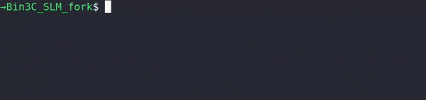

# Bin3C_SLM v0.1.1

This repository is a fork of [Bin3C_SLM](https://github.com/changlabtw/Bin3C_SLM), designed for deconvoluting metagenomic assemblies via Hi-C connect networks. Added features in the `ezcheck-full.py` script introduce new functionalities, specifically adding visualization and data output features for analyzing quality rankings derived from CheckM results. These additions aim to provide users with new ways to interpret and understand their data, complementing the existing capabilities of Bin3C_SLM.

## Added Functionality to ezcheck-full.py

### New Features:

- **CSV Summary Output**: Support for saving a summary of the quality rank distribution to a CSV file.
- **Visualization Capability**: A new feature allowing users to graphically represent the distribution of quality ranks.
- **Extended Quality Ranks**: Introduction of an additional rank category, "partial" to the existing quality ranks.
- **Genome size Filtering**: Allows users to filter analyses based on genome size, enabling focused examination of significant recovered genomes.
- **Biological Genome Stats**: Includes additional biological genome statistics from the CheckM output file.

## Original Features, Installation and Requirements

For detailed information on the core functionalities of Bin3C_SLM, please refer to the [original repository](https://github.com/changlabtw/Bin3C_SLM). The installation process and system requirements are consistent with the original Bin3C_SLM. Note any additional usage details for the new features in this branch here.

## Usage

The updated `ezcheck-full.py` script now produces three distinct output files, adding new functionality for the analysis of CheckM quality rankings and introducing visualization capabilities.

### Running the Script




Execute the `ezcheck-full.py` script using the following command in the terminal, specifying the input file and the output path and filename where the script will save the generated report, summary, and visualization files. Replace `<input_file>` with the path to your `bin_stats_ext.tsv` file from CheckM, and `<output_path/outfile.csv>` with the full path and filename for the output files.


To run the script, use the following command format: 
```bash
python3 ezcheck-full.py -f -b --min-genome-size 500000 --visualize -i <input_file> -o <output_path/outfile.csv>
```
Example:
```bash
python3 /home/bin3C/ezcheck-full.py -f -b --min-genome-size 500000 --visualize -i /data/bin_stats_ext.tsv -o /results/ezcheck_result.csv
```

This command runs the script with the following options:

- `-f`: Indicates the use of a Full Tree CheckM summary table.
- `-b`: Includes biological genome statistics in the output.
- `--min-genome-size 500000`: Filters the analysis to include only genomes larger than 500,000 base pairs.
- `--visualize`: Generates and saves a visualization of the rank distribution.
- `-i`: Specifies the input CheckM summary table.
- `-o`: Defines the output path for the generated report.

### Output Files

The script generates the following files in the specified output directory:

1. **CheckM Report CSV** (`<output_path>.csv`): Contains the detailed CheckM report for each bin, including the newly introduced "partial" quality rank
    
2. **Rank Summary CSV** (`<output_path>_rank_summary.csv`): Lists the count of bins classified into each quality rank category: Near, Substantial, Moderate, and Partial, providing a quick overview of the quality distribution
    
3. **Rank Distribution Visualization** (`<output_path>_rank_distribution.png`): Visualizes the distribution of quality ranks across all bins


_Figure 1: Rank distribution visualization without genome size filtering._


_Figure 2: Rank distribution visualization with genome size filtering applied (≥500kbp)._

## Acknowledgments

This project builds upon the original Bin3C_SLM tool developed by [changlabtw](https://github.com/changlabtw). I express my gratitude for their foundational work and to the authors of [bin3C](https://github.com/cerebis/bin3C).
